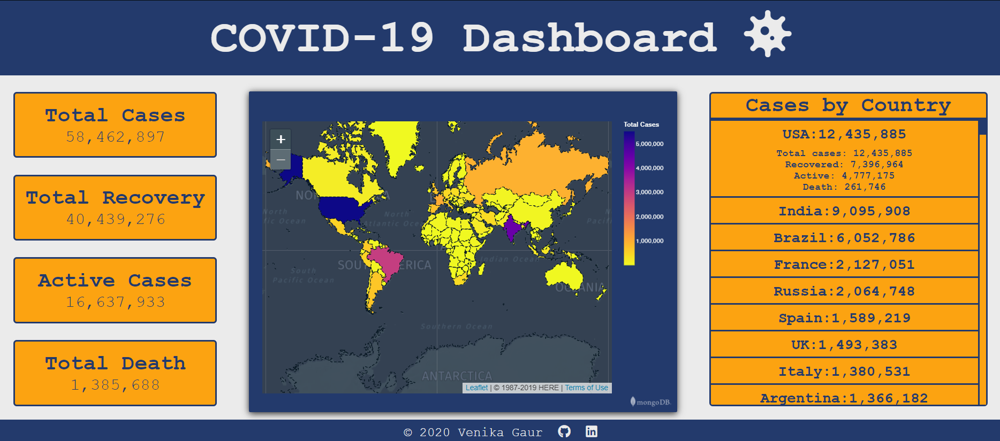

# COVID-19 Dashboard
This is a dashboard for visualizing COVID-19 data. Users can hover over each individual country in the table and see the info about the current COVID-19 status in that country. The chart represents that data in a geospatial way. Hovering over each country will display info about total cases in those countries.

# Development Process
I wanted to play around with data visualization and decided to visualize COVID-19 cases around the world. I began by grabbing data provided by Johns Hopkins University Center for Systems Science and Engineering. I used Python to prep the data and to convert it into a JSON file. After that, I created a Mongo DB Atlas cluster with that data and visualized it. For the data tables, I grabbed JSON data and then parsed through it to create columns of data.
The data table is refreshed in real time and the chart is updated weekly.

# Screenshot   
       

# Future updates
I would like to add a way to get the Mongo DB chart to get updated in real time. 

# Helpful links
* COVID-19 Data- https://github.com/CSSEGISandData/COVID-19
* JSON for grabbing real time data about COVID cases around the world- https://github.com/javieraviles/covidAPI     
* Choosing website colors- https://coolors.co/

